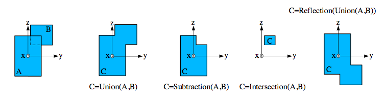

# Shapes

Shapes (or solids) are defined by specifying certain dimensions measured in the reference frame of these shapes. The origin of this reference system also serves as a handle when the solid is positioned in space. In the current schema implementation, only solids needed to describe the CMS detector are taken into account.

## Elementary Solids

DDL provides a set of elementary solids. They are defined in the same way as their counterparts in Geant4.

## Boolean and reflection solids



Figure 1: Defining solids from other solids: Two boxes A and B are combined into three types of boolean solids. The reflection solid reflects an already defined solid in the x - y plane of the reference frame. 

## Shapeless solid

A shapeless solid does not describe a shape. Thus it does not require the specification of parameters:

```<ShapelessSolid name=”NameOfShapelessSolid”/>```
